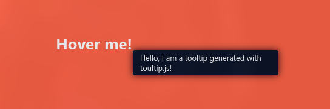

# Toultip.js


Create beautiful and customizable tooltips 🗨️ for your website 🎇

# Example

[A simple example of the usage of the library](https://skwalexe.github.io/Toultip.js/example.html) is provided in this repository.

# JsDelivr 

```html
<script src="https://cdn.jsdelivr.net/gh/SkwalExe/Toultip.js@v0.2.1/dist/toultip.min.js"></script>
```

# NPM module 

Install the npm module 

```bash
npm install toultip
```

And import it in your project 

```js
const Toultip = require('toultip');
```

**⚠️ You will need to bundle the package with your application (for example with browserify) because this library only works in the browser**

```bash
browserify index.js -o bundle.js
```

# Setting up 

You can import the library into you website with [JsDelivr](#JsDelivr) or, you can use the [npm module](#NPM-module) and import it in your project.

**You also need to import the css file to your website**

```html
<link rel="stylesheet" href="https://cdn.jsdelivr.net/npm/toultip@0.2.1/dist/themes/toultip-default.min.css">
```

# Your first tooltip 💫

To add a tooltip to an element of your website, just add a `toultip` attribute to it.

```html
<h1 toultip="Hello, I am a tooltip generated with toultip.js!">Hover me!</h1>
```



At the end of the body, you must run

```js
Toultip.init(1000, true);
```

This function can take two optional parameters:
- `1000` is timeout in milliseconds before showing the tooltip.
- `true` to prevent the tooltip from overflowing the screen.

# final

If you have any problem, don't hesitate to open an issue

# Contributing 💪

1. Start by [**forking** this repository](https://github.com/SkwalExe/MessageBox.js/fork)

2. Then clone your fork to your local machine.
  ```git
  git clone https://github.com/your-username/MessageBox.js.git
  ```

3. Install dev dependencies
```npm
npm install --save-dev
```

4. Create a new branch
  ```git
  git checkout -b super-cool-feature
  ```

5. Then make your changes

6. Update the changelog and version number if needed (using [Semantic Versioning](https://semver.org)) also, update the version number in the JsDelivr links (js and css)
  ```bash
  # bug fix
  npm version patch --no-git-tag-version

  # add a new feature 
  npm version minor --no-git-tag-version
  
  # changes that break backwards compatibility
  npm version major --no-git-tag-version
  ```

7. List and correct linting errors
  ```bash
  npm run lint
  ```

8. Update the minified/browser version of the library
  ```bash
  npm run build
  ```


9. Once you're done, commit your changes and push them to the remote repository.
  ```git
  git add --all
  git commit -m "Add super-cool-feature"
  git push origin super-cool-feature
  ```

10. Then, open a pull request on GitHub from your fork.
    1. Go to [this link](https://github.com/SkwalExe/MessageBox.js/compare/)
    2. Click compare across forks
    3. On the right, on `head repository` select your fork
    4. And on `compare` select the branch you just created
    5. Click on `Create Pull Request` and submit your pull request

<a href="https://github.com/SkwalExe#ukraine"></a>